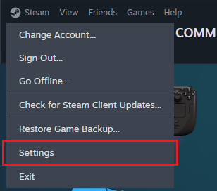
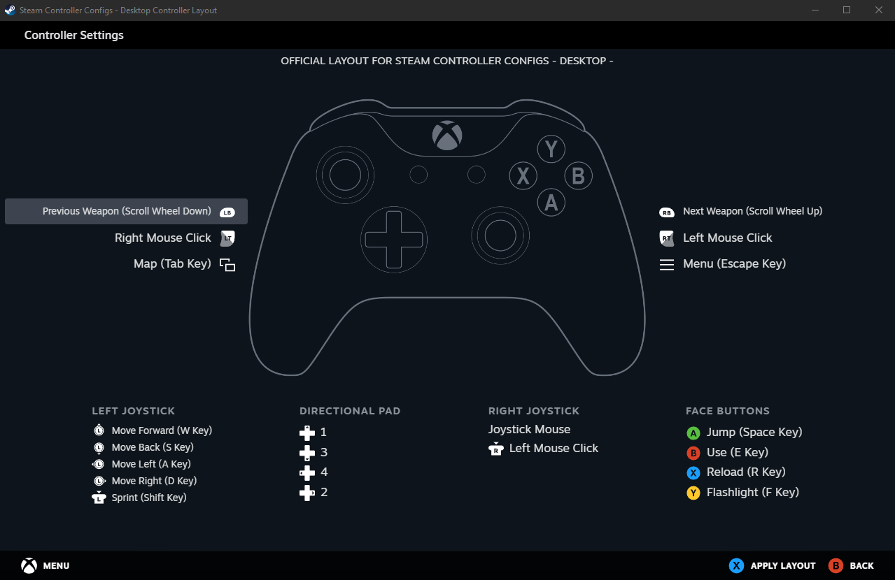
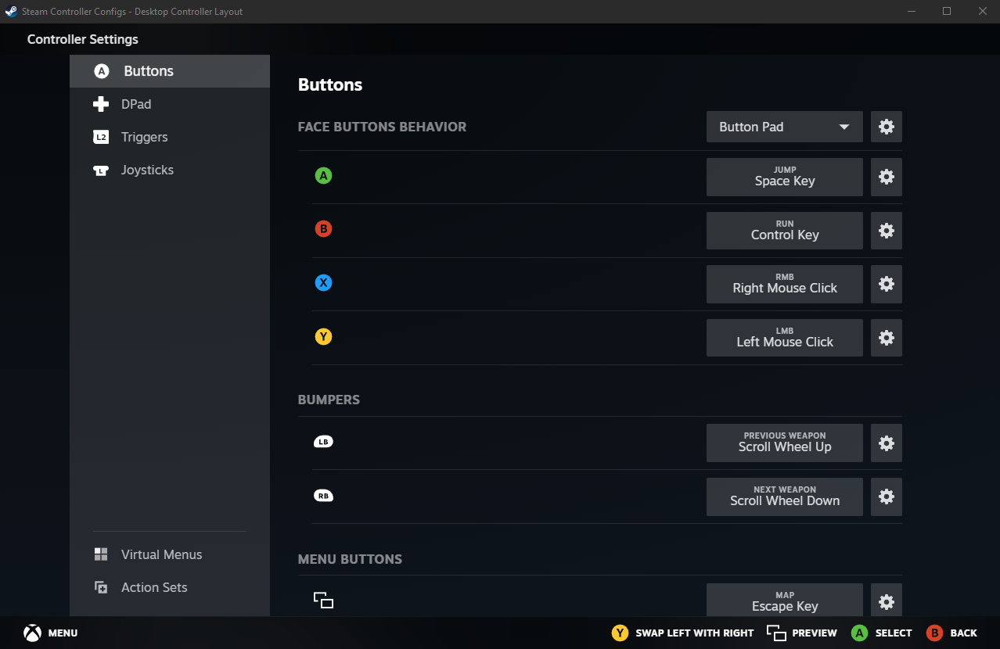
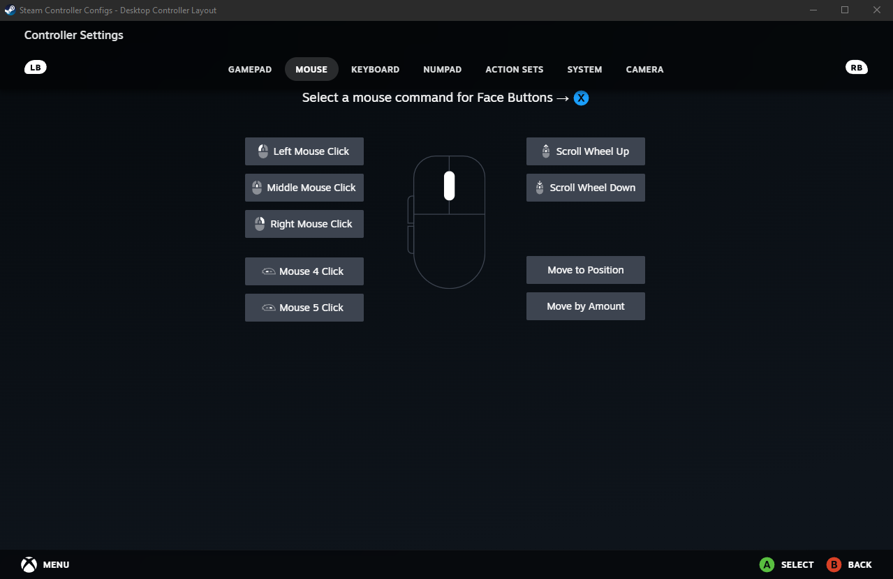
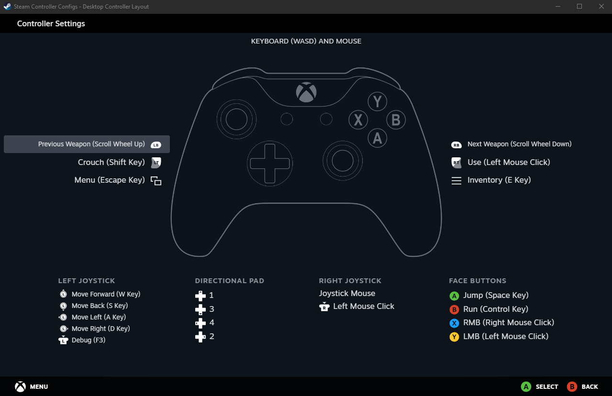

If you've ever played Minecraft you probably know what it's like to have your hand cramp up after spending hours mining for diamonds and other goodies. But did you know you can actually avoid putting your fingers and wrists through all that pain by using a controller instead of the usual keyboard and mouse? While Minecraft does not natively support controller inputs (at least as of current patch 1.21.5), players can still use a controller to play Minecraft as long as they have a Steam account. By using Steam Input players can map keyboard and mouse inputs to their controller buttons, allowing them to use a controller even with non-Steam games like Minecraft.

This guide will walk you through the steps of enabling Steam Input and setting up your controller to work with Minecraft (and any other game without native controller support).

## Step 1: Open Steam Settings

Log in to your Steam account. Once you're logged in, click on `Steam -> Settings` in the upper left to open the Steam Settings menu.

## Step 2: Enable Controller Input

In Steam Settings, scroll down and click on the `Controller` menu on the left sidebar (1). Next toggle the button to enable Steam Input (2) for your specific controller (Xbox, Switch Pro, or generic). Finally, scroll down to `Non-Game Controller Layouts` and click "Edit" next to `Desktop Layout` (3).

## Step 3: Select Your Controller Layout

Steam will show the controller layout you have currently selected. Click on it to change your current layout, then navigate to the `Templates` tab and select "Keyboard (WASD) and Mouse."

You will see a preview of the current controller bindings for the Keyboard and Mouse template. Click "Apply Layout" on the bottom right to select the template.

## Step 4: Customize Your Bindings

Selecting the template will automatically take you back to the page that shows your current controller layout. Click the "Edit" button to begin remapping your controller bindings.

From here you can change the bindings to whatever you like. Simply click on the currently bound keys and change them to your desired input. To assign a name to a keybind, click the cogwheel next to it and select "Rename command". The image below shows what it looks like to rebind the "X" key to a mouse input.

Below is an example keybind map for playing Minecraft specifically.

Steam automatically saves each keybind selection, so when you're done making changes simply close out of all menus.

Now you're all done! Enjoy playing Minecraft with your controller.
