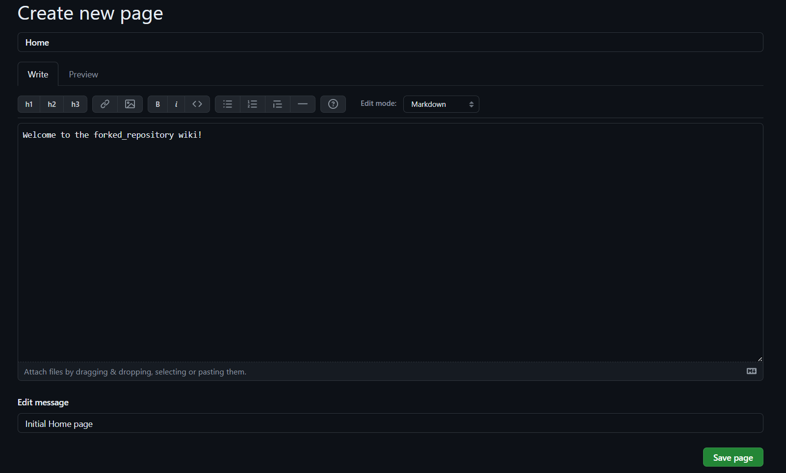
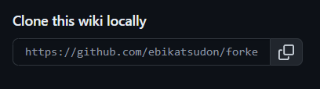
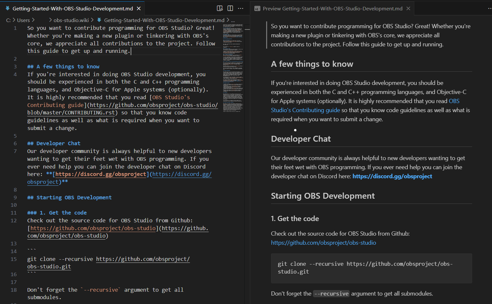

Have you ever wanted to contribute to a project's documentation, but found that it's only available through a wiki on Github?

Although Github does allow direct editing of wikis (in fact, pull requests aren't supported for wiki changes), you can only do so if you have write access to the repository. While some projects allow anyone on Github to make wiki changes, others require you to be marked as a collaborator. However, there IS a way to make changes to the wiki even if you don't have write access permissions.

You might be thinking, *"Oh, I know! I just have to fork the repo and then edit the wiki on my fork."*

 Unfortunately, it's not quite that simple. When you fork a repository in Github, any existing wiki pages **will not** be copied onto your fork. This is because Github actually treats the wiki as a *separate repository* from the main one.

If you just want to make some changes for yourself or use the wiki as a reference, you can clone the wiki repository and edit it locally. But if you want the project owner to actually review and potentially even commit your changes, you'll need a way for them to actually see your edits.

In theory, you could open an issue in the original repo (assuming issues are enabled) and suggest your edits there. However, if you're dead-set on getting your edited wiki onto Github, below is a step-by-step process. As an example, we will be making a fork of the wiki for the [OBS Project](https://github.com/obsproject/obs-studio/wiki).

## Step 1: Fork the repository
In the upper right of the repository's main page, click the Fork button to create your own copy of the repo. 

## Step 2: Clone the wiki

After forking the repo, go to the wiki tab of your newly-forked repo.

You should see that your wiki currently has no content. Press the "Create the first page" button to create a home page for your wiki.

You don't have to actually write anything here! Just click save page on the bottom right. This step is just to populate your wiki with *something* in order to create a repo you can push changes to later on.

After saving your home page, a link to it will appear in the bottom right of your wiki. Copy this link.

You'll want to add this newly-created wiki as a remote repository so you can push your changes to it later on. Open your git terminal and run the following:

    // Adds your forked wiki as a remote repository.

    git remote add fork https://github.com/ebikatsudon/forked_repository.wiki.git

Next, you'll want to clone the *original* wiki onto your machine. Go back to the original repository you made the fork from, and navigate to *its* wiki. The link to clone it should again be on the bottom right right. Copy that link.

 Run the following in your git terminal to clone the original wiki to your machine:

    // Clones the wiki.

    git clone https://github.com/obsproject/obs-studio.wiki.git

Now you can finally start editing!

## Step 3: Edit the wiki

On your machine, navigate to the folder where your local copy of the wiki is stored. You'll notice that it contains a bunch of Markdown (.md) files. Each wiki page that you see on Github is stored in one of these files.

Once you know which page you want to edit, open the corresponding .md file in your editor of choice (the image below shows Visual Studio Code) and make your changes.

## Step 4: Push your edits

When you're done editing, you'll want to push those changes back onto your forked repo. First, make sure to set your working directory in git to the correct one.

    // Changes your current working directory to the one specified. The file path will vary depending on where you cloned the original repository.

    cd /c/Users/ebikatsudon/obs-studio.wiki

Then stage and commit your file(s).

    // Stages your changes.

    git add .
    
    // Commits your changes.

    git commit -m "Your commit message here"

Finally, you can push your changes. You'll need to use the force command `-f` so that git overwrites your empty placeholder wiki with all of the files you've cloned and changed.

    // Pushes your file onto Github.
    
    git push -f fork master

Now, in your web browser, refresh the wiki page for your forked repo. The original wiki files -- with your edits -- should now appear. Congrats, you've successfully forked the wiki!

## Step 5: Contact the original repo owner

To get the project owner to review your wiki edits, you can open an issue in the original repo and directly link your forked wiki repo. If issues are not enabled, you can alternatively send the link through email.

### Happy editing!
